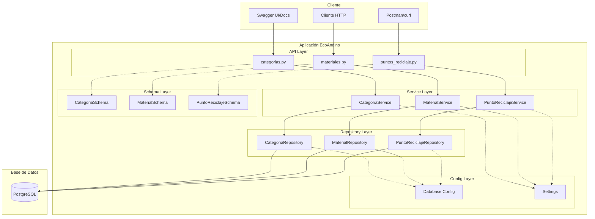
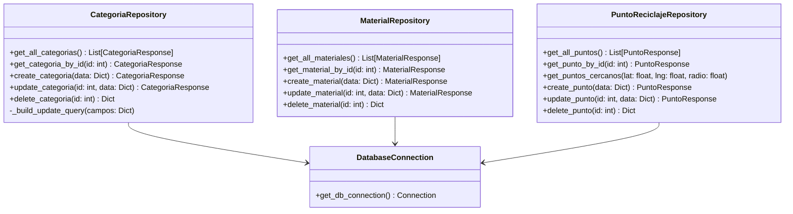
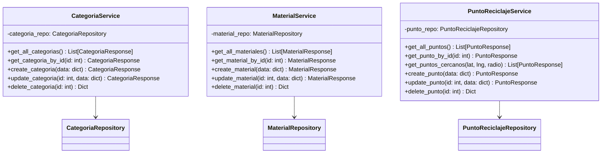
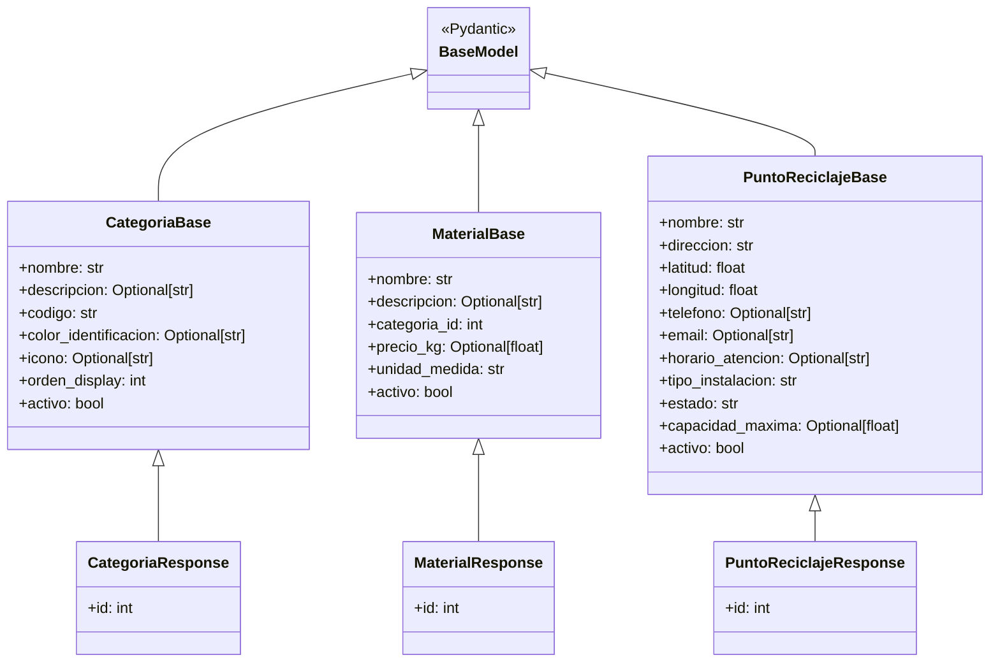
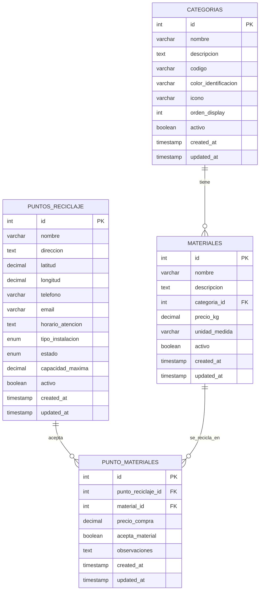
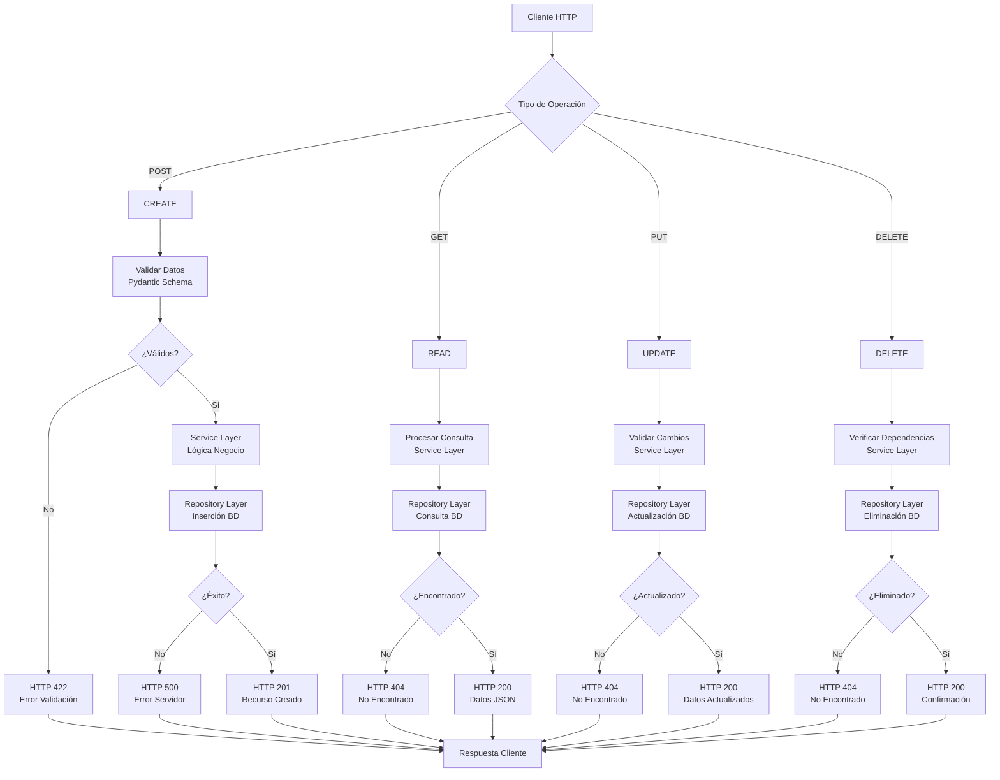
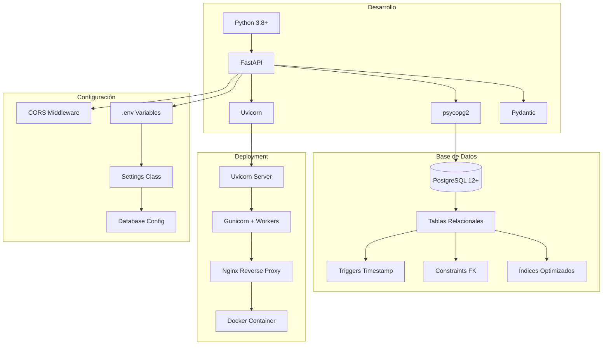

# EcoAndino - Diagramas Arquitectónicos

## 🏗️ Arquitectura General del Sistema

### Diagrama de Arquitectura en Capas



## 📊 Diagrama de Patrones de Diseño

### Repository Pattern



### Service Layer Pattern



### DTO Pattern (Data Transfer Objects)



## 🗄️ Diagrama de Base de Datos

### Modelo Entidad-Relación



## 🔄 Diagrama de Flujo CRUD

### Flujo de Operaciones CRUD



## 🌐 Diagrama de API REST

### Endpoints y Métodos HTTP

```mermaid
graph LR
    subgraph "API REST EcoAndino"
        subgraph "Categorías"
            CAT1[GET /categorias<br/>Listar todas]
            CAT2[POST /categorias<br/>Crear nueva]
            CAT3[GET /categorias/{id}<br/>Obtener por ID]
            CAT4[PUT /categorias/{id}<br/>Actualizar]
            CAT5[DELETE /categorias/{id}<br/>Eliminar]
        end
        
        subgraph "Materiales"
            MAT1[GET /materiales<br/>Listar todos]
            MAT2[POST /materiales<br/>Crear nuevo]
            MAT3[GET /materiales/{id}<br/>Obtener por ID]
            MAT4[PUT /materiales/{id}<br/>Actualizar]
            MAT5[DELETE /materiales/{id}<br/>Eliminar]
        end
        
        subgraph "Puntos de Reciclaje"
            PTO1[GET /puntos-reciclaje<br/>Listar todos]
            PTO2[POST /puntos-reciclaje<br/>Crear nuevo]
            PTO3[GET /puntos-reciclaje/{id}<br/>Obtener por ID]
            PTO4[PUT /puntos-reciclaje/{id}<br/>Actualizar]
            PTO5[DELETE /puntos-reciclaje/{id}<br/>Eliminar]
            PTO6[GET /puntos-reciclaje/cercanos<br/>Búsqueda geoespacial]
        end
    end
    
    subgraph "Códigos de Respuesta HTTP"
        HTTP1[200 - OK]
        HTTP2[201 - Created]
        HTTP3[404 - Not Found]
        HTTP4[422 - Validation Error]
        HTTP5[500 - Server Error]
    end
    
    CAT1 --> HTTP1
    CAT2 --> HTTP2
    CAT3 --> HTTP1
    CAT3 --> HTTP3
    MAT1 --> HTTP1
    PTO6 --> HTTP1
```

## 🔧 Diagrama de Configuración y Deployment

### Componentes del Sistema



---

## 📋 Resumen de Diagramas

### **1. Arquitectura en Capas**
- ✅ Separación clara de responsabilidades
- ✅ API → Service → Repository → Database
- ✅ Schemas transversales para validación

### **2. Patrones de Diseño**
- ✅ Repository Pattern: Acceso a datos encapsulado
- ✅ Service Layer: Lógica de negocio centralizada
- ✅ DTO Pattern: Transferencia de datos tipada

### **3. Base de Datos Relacional**
- ✅ Modelo normalizado con relaciones FK
- ✅ Integridad referencial garantizada
- ✅ Optimización con índices

### **4. API REST Completa**
- ✅ Operaciones CRUD para todas las entidades
- ✅ Códigos HTTP estándar
- ✅ Documentación automática

### **5. Flujo de Datos**
- ✅ Validación automática con Pydantic
- ✅ Manejo estructurado de errores
- ✅ Respuestas JSON consistentes

Estos diagramas demuestran la implementación profesional de una arquitectura sólida que cumple completamente con los requisitos académicos del proyecto.
