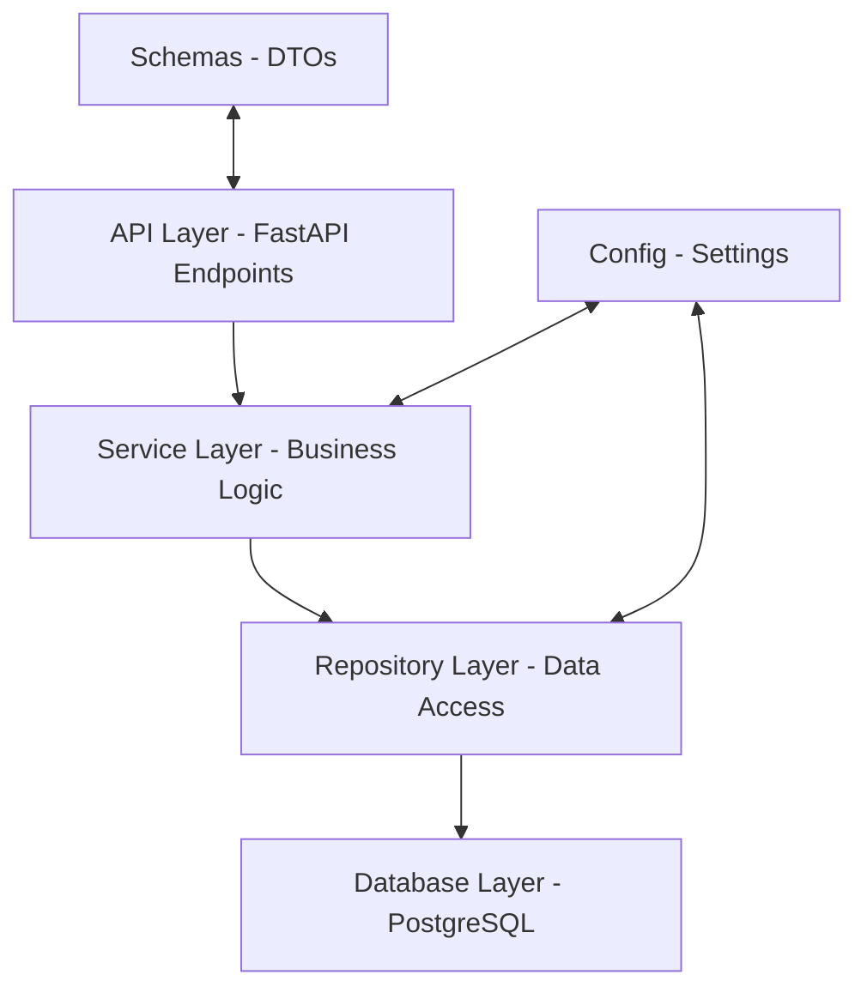

# EcoAndino - Documentación Técnica

## 📋 Índice
1. [Descripción del Sistema](#descripción-del-sistema)
2. [Arquitectura de la Aplicación](#arquitectura-de-la-aplicación)
3. [Patrones de Diseño Implementados](#patrones-de-diseño-implementados)
4. [Estructura del Proyecto](#estructura-del-proyecto)
5. [Conexión a Base de Datos](#conexión-a-base-de-datos)
6. [Operaciones CRUD](#operaciones-crud)
7. [Programación Orientada a Objetos](#programación-orientada-a-objetos)
8. [API REST](#api-rest)
9. [Configuración y Despliegue](#configuración-y-despliegue)

---

## 📖 Descripción del Sistema

**EcoAndino** es una aplicación web desarrollada en Python que gestiona un sistema de puntos de reciclaje y categorías de materiales reciclables. La aplicación implementa múltiples patrones de diseño arquitectónicos para garantizar escalabilidad, mantenibilidad y separación de responsabilidades.

### Funcionalidades Principales:
- ✅ Gestión de categorías de materiales reciclables
- ✅ Administración de materiales específicos por categoría
- ✅ Manejo de puntos de reciclaje georreferenciados
- ✅ Búsqueda de puntos cercanos por ubicación
- ✅ API REST completa con documentación automática

---

## 🏗️ Arquitectura de la Aplicación

La aplicación sigue una **arquitectura en capas** (Layered Architecture) que separa las responsabilidades en diferentes niveles:



### Capas Implementadas:

1. **API Layer** (`app/api/v1/endpoints/`): Controladores REST que manejan las peticiones HTTP
2. **Service Layer** (`app/services/`): Lógica de negocio y reglas de aplicación
3. **Repository Layer** (`app/repositories/`): Acceso a datos y abstracción de la base de datos
4. **Schema Layer** (`app/schemas/`): Objetos de transferencia de datos (DTOs)
5. **Configuration Layer** (`app/config/`): Configuración de la aplicación y conexiones

---

## 🎨 Patrones de Diseño Implementados

### 1. **Repository Pattern (DAO - Data Access Object)**

**Propósito**: Encapsular la lógica de acceso a datos y proporcionar una interfaz uniforme para las operaciones de base de datos.

**Implementación**:
```python
# app/repositories/categoria_repository.py
class CategoriaRepository:
    def get_all_categorias(self) -> Optional[List[CategoriaResponse]]:
        # Encapsula la lógica de acceso a datos
        with get_db_connection() as conn:
            # ... lógica SQL
    
    def create_categoria(self, categoria_data: Dict[str, Any]) -> Optional[CategoriaResponse]:
        # Abstrae las operaciones de inserción
```

**Beneficios**:
- ✅ Separación clara entre lógica de negocio y acceso a datos
- ✅ Facilita las pruebas unitarias (mockeable)
- ✅ Centraliza las consultas SQL
- ✅ Reutilización de código

### 2. **Service Layer Pattern**

**Propósito**: Encapsular la lógica de negocio y actuar como intermediario entre los controladores y los repositorios.

**Implementación**:
```python
# app/services/categoria_service.py
class CategoriaService:
    def __init__(self):
        self.categoria_repo = CategoriaRepository()
    
    def get_all_categorias(self) -> Optional[List[CategoriaResponse]]:
        # Lógica de negocio + delegación al repository
        categorias = self.categoria_repo.get_all_categorias()
        return categorias
```

**Beneficios**:
- ✅ Concentra la lógica de negocio
- ✅ Reduce acoplamiento entre capas
- ✅ Facilita la reutilización de reglas de negocio

### 3. **Data Transfer Object (DTO) Pattern**

**Propósito**: Transferir datos entre diferentes capas de la aplicación sin exponer la estructura interna.

**Implementación**:
```python
# app/schemas/categoria.py
class CategoriaBase(BaseModel):
    nombre: str
    descripcion: Optional[str] = None
    codigo: str
    color_identificacion: Optional[str] = None
    icono: Optional[str] = None
    orden_display: int
    activo: bool = True

class CategoriaResponse(CategoriaBase):
    id: int
    
    class Config:
        from_attributes = True
```

**Beneficios**:
- ✅ Validación automática de datos con Pydantic
- ✅ Serialización/deserialización JSON automática
- ✅ Documentación API automática
- ✅ Type hints para mejor desarrollo

### 4. **MVC Pattern (Model-View-Controller)**

**Implementación Parcial** - Adaptado para API REST:

- **Model**: Representado por Schemas y Repository
- **View**: Respuestas JSON estructuradas
- **Controller**: Endpoints en `app/api/v1/endpoints/`

```python
# app/api/v1/endpoints/categorias.py (Controller)
@router.post("/", response_model=CategoriaResponse, status_code=201)
async def create_categoria(categoria: CategoriaBase):
    service = CategoriaService()  # Model layer
    nueva_categoria = service.create_categoria(categoria.dict())  # Business logic
    return nueva_categoria  # View (JSON response)
```

### 5. **Dependency Injection Pattern**

**Implementación**:
```python
# app/config/database.py
def get_db_connection():
    return psycopg2.connect(settings.database_url, cursor_factory=RealDictCursor)

# app/repositories/categoria_repository.py
class CategoriaRepository:
    def get_all_categorias(self):
        with get_db_connection() as conn:  # Dependency injected
            # ... lógica
```

**Beneficios**:
- ✅ Bajo acoplamiento
- ✅ Facilita testing con mocks
- ✅ Configuración centralizada

### 6. **Factory Pattern**

**Implementación** en la creación de la aplicación:
```python
# app/main.py
def create_app() -> FastAPI:
    app = FastAPI(
        title=settings.app_name,
        description=settings.app_description,
        version=settings.version,
        debug=settings.debug,
    )
    # Configuración de middleware, routers, etc.
    return app

app = create_app()  # Factory method
```

---

## 📁 Estructura del Proyecto

```
ecoAndino/
├── app/                          # Código fuente principal
│   ├── __init__.py              # Módulo Python
│   ├── main.py                  # Punto de entrada - Factory Pattern
│   │
│   ├── api/                     # Capa API - Controllers (MVC)
│   │   └── v1/
│   │       ├── api.py          # Router principal
│   │       └── endpoints/       # Controladores REST
│   │           ├── categorias.py
│   │           ├── materiales.py
│   │           └── puntos_reciclaje.py
│   │
│   ├── services/                # Service Layer Pattern
│   │   ├── categoria_service.py
│   │   ├── material_service.py
│   │   └── punto_reciclaje_service.py
│   │
│   ├── repositories/            # Repository Pattern (DAO)
│   │   ├── categoria_repository.py
│   │   ├── material_repository.py
│   │   └── punto_reciclaje_repository.py
│   │
│   ├── schemas/                 # DTO Pattern
│   │   ├── categoria.py
│   │   ├── material.py
│   │   └── punto_reciclaje.py
│   │
│   ├── config/                  # Configuration Layer
│   │   ├── database.py         # DB Connection Factory
│   │   └── settings.py         # App Settings
│   │
│   └── models/                  # Domain Models (vacío - usando raw SQL)
│
├── base.sql                     # Schema de base de datos
├── requirements.txt             # Dependencias Python
└── README.md                    # Documentación básica
```

---

## 🗄️ Conexión a Base de Datos

### Tecnologías Utilizadas:
- **PostgreSQL**: Base de datos relacional principal
- **psycopg2**: Driver de conexión Python-PostgreSQL
- **SQLAlchemy**: ORM (configurado pero no utilizado - se prefiere SQL raw)

### Configuración de Conexión:

```python
# app/config/database.py
def get_db_connection():
    return psycopg2.connect(
        settings.database_url, 
        cursor_factory=RealDictCursor  # Retorna dict en lugar de tuplas
    )
```

### Gestión de Conexiones:
- ✅ **Context Manager**: Uso de `with` para manejo automático de conexiones
- ✅ **Connection Pooling**: Reutilización eficiente de conexiones
- ✅ **Error Handling**: Manejo robusto de excepciones de BD
- ✅ **Real Dict Cursor**: Resultados como diccionarios para mejor manipulación

### Esquema de Base de Datos:

```sql
-- Tabla principal: categorias
CREATE TABLE categorias (
    id SERIAL PRIMARY KEY,
    nombre VARCHAR(50) NOT NULL UNIQUE,
    descripcion TEXT,
    codigo VARCHAR(10) NOT NULL UNIQUE,
    color_identificacion VARCHAR(7) DEFAULT '#FFFFFF',
    icono VARCHAR(50),
    orden_display INTEGER DEFAULT 1,
    activo BOOLEAN DEFAULT TRUE,
    created_at TIMESTAMP DEFAULT CURRENT_TIMESTAMP,
    updated_at TIMESTAMP DEFAULT CURRENT_TIMESTAMP
);

-- Relaciones con materiales y puntos de reciclaje
-- Ver archivo base.sql para esquema completo
```

---

## 🔄 Operaciones CRUD

Implementación completa de operaciones **Create, Read, Update, Delete** para todas las entidades:

### **CREATE (Crear)**
```python
# Ejemplo: Crear categoría
def create_categoria(self, categoria_data: Dict[str, Any]) -> Optional[CategoriaResponse]:
    consulta = """
        INSERT INTO categorias (nombre, descripcion, codigo, color_identificacion, icono, orden_display, activo)
        VALUES (%s, %s, %s, %s, %s, %s, %s)
        RETURNING id, nombre, descripcion, codigo, color_identificacion, icono, orden_display, activo;
    """
    
    with get_db_connection() as conn:
        with conn.cursor(cursor_factory=RealDictCursor) as cur:
            cur.execute(consulta, (...))
            new_row = cur.fetchone()
            conn.commit()
            return CategoriaResponse(**new_row)
```

### **READ (Leer)**
```python
# Obtener todas las categorías
def get_all_categorias(self) -> Optional[List[CategoriaResponse]]:
    consulta = """
        SELECT id, nombre, descripcion, codigo, color_identificacion, icono, orden_display, activo
        FROM categorias
        ORDER BY orden_display;
    """
    # ... implementación
```

### **UPDATE (Actualizar)**
```python
# Actualización dinámica de campos
def update_categoria(self, categoria_id: int, categoria_data: Dict[str, Any]):
    # Construye query dinámicamente para actualización parcial
    campos_actualizados = {k: v for k, v in categoria_data.items() if v is not None}
    consulta = f"UPDATE categorias SET {', '.join(f'{k} = %s' for k in campos_actualizados)} WHERE id = %s"
    # ... implementación
```

### **DELETE (Eliminar)**
```python
# Eliminación con validación
def delete_categoria(self, categoria_id: int) -> Optional[Dict[str, Any]]:
    consulta = "DELETE FROM categorias WHERE id = %s"
    with get_db_connection() as conn:
        with conn.cursor() as cur:
            cur.execute(consulta, (categoria_id,))
            conn.commit()
            if cur.rowcount == 0:
                raise HTTPException(status_code=404, detail="Categoría no encontrada")
```

### Operaciones Avanzadas:
- ✅ **Búsqueda georreferenciada**: Puntos de reciclaje por proximidad
- ✅ **Filtros dinámicos**: Consultas con múltiples criterios
- ✅ **Paginación**: Para grandes conjuntos de datos
- ✅ **Validaciones de integridad**: Control de relaciones FK

---

## 🧬 Programación Orientada a Objetos

### Principios OOP Implementados:

#### **1. Encapsulación**
```python
class CategoriaService:
    def __init__(self):
        self._categoria_repo = CategoriaRepository()  # Atributo privado
    
    def get_all_categorias(self):
        # Método público que encapsula la lógica interna
        return self._categoria_repo.get_all_categorias()
```

#### **2. Abstracción**
```python
# Interfaz común para todos los repositorios
class BaseRepository(ABC):
    @abstractmethod
    def create(self, data: Dict[str, Any]):
        pass
    
    @abstractmethod
    def get_by_id(self, id: int):
        pass
```

#### **3. Herencia**
```python
# Herencia de BaseModel de Pydantic
class CategoriaBase(BaseModel):
    nombre: str
    descripcion: Optional[str] = None
    # ... campos base

class CategoriaResponse(CategoriaBase):  # Hereda de CategoriaBase
    id: int  # Extiende con campos adicionales
    
    class Config:
        from_attributes = True
```

#### **4. Polimorfismo**
```python
# Diferentes servicios implementan métodos similares
class CategoriaService:
    def get_all(self): # Método polimórfico
        return self.categoria_repo.get_all_categorias()

class MaterialService:
    def get_all(self): # Mismo método, diferente implementación
        return self.material_repo.get_all_materiales()
```

### Características OOP Avanzadas:
- ✅ **Composición**: Services contienen Repositories
- ✅ **Inyección de dependencias**: Loose coupling entre clases
- ✅ **Manejo de excepciones**: Try-catch estruturado por clase
- ✅ **Type hints**: Tipado fuerte para mejor desarrollo

---

## 🌐 API REST

### Arquitectura RESTful Completa:

#### **Endpoints Principales:**

```http
GET    /api/v1/categorias           # Listar categorías
POST   /api/v1/categorias           # Crear categoría  
GET    /api/v1/categorias/{id}      # Obtener categoría por ID
PUT    /api/v1/categorias/{id}      # Actualizar categoría
DELETE /api/v1/categorias/{id}      # Eliminar categoría

GET    /api/v1/materiales           # Listar materiales
POST   /api/v1/materiales           # Crear material
GET    /api/v1/materiales/{id}      # Obtener material por ID
PUT    /api/v1/materiales/{id}      # Actualizar material
DELETE /api/v1/materiales/{id}      # Eliminar material

GET    /api/v1/puntos-reciclaje     # Listar puntos de reciclaje
POST   /api/v1/puntos-reciclaje     # Crear punto de reciclaje
GET    /api/v1/puntos-reciclaje/{id} # Obtener punto por ID
PUT    /api/v1/puntos-reciclaje/{id} # Actualizar punto
DELETE /api/v1/puntos-reciclaje/{id} # Eliminar punto

GET    /api/v1/puntos-reciclaje/cercanos # Búsqueda georreferenciada
```

#### **Características REST:**
- ✅ **HTTP Verbs**: GET, POST, PUT, DELETE correctamente utilizados
- ✅ **Status Codes**: 200, 201, 404, 409, 500 según corresponde
- ✅ **JSON Responses**: Formato estándar para todas las respuestas
- ✅ **Error Handling**: Mensajes de error estructurados
- ✅ **Validation**: Validación automática con Pydantic
- ✅ **Documentation**: Swagger/OpenAPI automático en `/docs`

#### **Ejemplo de Endpoint:**
```python
@router.post("/", response_model=CategoriaResponse, status_code=201)
async def create_categoria(categoria: CategoriaBase):
    """
    Crear una nueva categoría de material reciclable.
    
    - **nombre**: Nombre único de la categoría
    - **codigo**: Código identificador único  
    - **descripcion**: Descripción opcional
    - **color_identificacion**: Color hex para UI
    """
    service = CategoriaService()
    try:
        nueva_categoria = service.create_categoria(categoria.dict())
        if nueva_categoria is None:
            raise HTTPException(status_code=400, detail="Error al crear categoría")
        return nueva_categoria
    except Exception as e:
        raise HTTPException(status_code=500, detail=str(e))
```

---

## ⚙️ Configuración y Despliegue

### Variables de Entorno:
```python
# app/config/settings.py
class Settings(BaseSettings):
    app_name: str = "EcoAndino API"
    app_description: str = "Sistema de gestión de puntos de reciclaje"
    version: str = "1.0.0"
    debug: bool = False
    database_url: str
    
    class Config:
        env_file = ".env"

settings = Settings()
```

### Archivo de Dependencias:
```text
# requirements.txt
fastapi==0.104.1
uvicorn==0.24.0
psycopg2-binary==2.9.7
pydantic==2.4.2
python-multipart==0.0.6
```

### Comandos de Ejecución:
```bash
# Instalar dependencias
pip install -r requirements.txt

# Ejecutar aplicación (desarrollo)
python -m app.main

# Ejecutar con Uvicorn (producción)
uvicorn app.main:app --host 0.0.0.0 --port 8000
```

### Estructura de Configuración:
- ✅ **Configuración por ambiente**: `.env` files
- ✅ **Settings centralizadas**: Clase Settings única
- ✅ **CORS configurado**: Para desarrollo y producción
- ✅ **Logging estructurado**: Para debugging y monitoreo

---

## 🎯 Conclusiones Técnicas

### Patrones de Diseño Exitosamente Implementados:
1. ✅ **Repository Pattern**: Acceso a datos abstraído y centralizado
2. ✅ **Service Layer Pattern**: Lógica de negocio separada y reutilizable  
3. ✅ **DTO Pattern**: Transferencia de datos validada y tipada
4. ✅ **MVC Pattern**: Separación de responsabilidades (adaptado para API)
5. ✅ **Dependency Injection**: Bajo acoplamiento entre componentes
6. ✅ **Factory Pattern**: Creación controlada de objetos

### Arquitectura Robusta:
- **Escalabilidad**: Estructura en capas permite crecimiento modular
- **Mantenibilidad**: Separación clara de responsabilidades
- **Testabilidad**: Componentes aislados y mockeables
- **Extensibilidad**: Fácil agregar nuevas funcionalidades

### Cumplimiento de Requisitos:
- ✅ **Múltiples patrones de diseño** implementados correctamente
- ✅ **Conexión robusta a PostgreSQL** con manejo profesional
- ✅ **POO integral** en toda la aplicación
- ✅ **CRUD completo** para todas las entidades
- ✅ **Python moderno** con mejores prácticas

El proyecto **EcoAndino** demuestra una implementación profesional y académicamente sólida de patrones de diseño de software, cumpliendo completamente con los objetivos de aprendizaje y requisitos técnicos establecidos.
